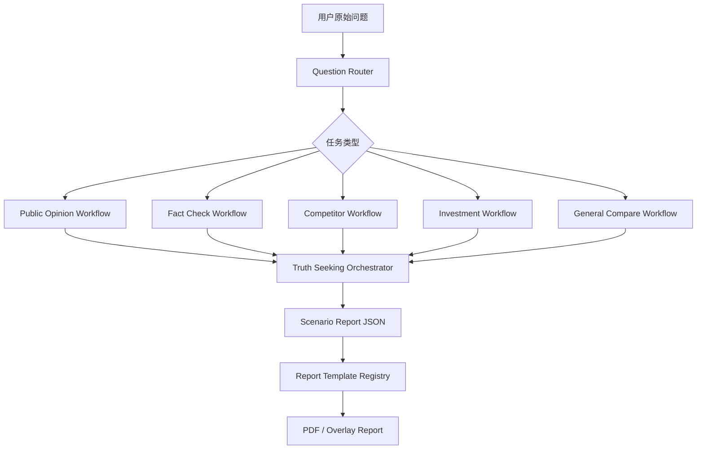

# 场景化执行链路与报告模板实施方案

## 目标

把当前「一条通用多模型去伪链路」升级为「按客户问题自动选择执行链路和报告模板」的多源大模型情报分析平台。

用户不需要理解 Prompt、模型差异或报告结构。系统先判断问题类型，再选择最合适的分析链路、追问策略、污染剔除规则和报告模板，最终输出能直接决策的专业报告。

## 核心判断

当前产品的商业价值不在「同时打开多个 AI 窗口」，而在「把多个 AI 的混乱回答变成可采信结论」。下一阶段的壁垒应该从多模型分发升级为场景化裁决能力。

新的产品主线：

```text
用户问题
→ 任务路由
→ 场景化问题补全
→ 多模型分发
→ 主张抽取
→ 差异识别
→ 场景化追问
→ 污染剔除
→ 可信度评分
→ 场景报告模板
→ 决策结论
```

## 设计原则

- AI 回答是线索，不是证据。
- 每个场景有自己的判断标准，不共用一套泛化报告。
- 用户看到的是决策报告，不是模型聊天记录。
- 路由、Prompt、流程编排、报告渲染必须分模块，不允许继续塞进 `app.js` 或单个大模板文件。
- 默认报告名称保持为 `滤镜·多源大模型内容对比分析`，不得因模板改版漂移。

## 第一阶段支持的 4 类任务

### 1. 舆情裁决

适合问题：

- 「某明星最近舆论怎么样？」
- 「某品牌是不是翻车了？」
- 「这个事件有没有发酵？」

目标：

判断是否形成真实舆情事件、风险等级、是否需要回应、下一步核验动作。

关键字段：

- 舆论温度
- 负面密度
- 阵营分布
- 核心叙事
- 可验证事实
- 污染信息
- 是否需要公开回应

报告结构：

```text
封面裁决
Executive War Room
用户问题裁决
舆论结构看板
事实时间轴
证据漏斗
差异侦查台
污染剔除裁决
下一步核验行动
审计附录
```

### 2. 内容真假核验

适合问题：

- 「这个爆料真实吗？」
- 「这段话是不是谣言？」
- 「这张图/这篇文章可信吗？」

目标：

把内容拆成可验证主张，判断真假、来源强度和污染类型。

关键字段：

- 原始主张
- 可验证事实
- 反证
- 信源等级
- 旧闻翻炒
- 张冠李戴
- AI 生成痕迹
- 最终可信度

报告结构：

```text
真假裁决
主张拆解
证据链地图
反证与冲突
污染源识别
可信度评分
最终结论
核验建议
```

### 3. 竞品对比

适合问题：

- 「A 产品和 B 产品哪个好？」
- 「竞品最近有什么动作？」
- 「这个产品相比竞品优势在哪？」

目标：

基于多个模型与可验证资料，输出选型、差异、风险和建议。

关键字段：

- 对比对象
- 对比维度
- 功能差异
- 价格/定位
- 渠道/用户反馈
- 风险点
- 推荐选型

报告结构：

```text
选型结论
对比对象定义
核心差异矩阵
优势与短板
场景适配度
风险与不确定性
最终建议
```

### 4. 投研 / 政策影响

适合问题：

- 「这个政策对某行业有什么影响？」
- 「某公司最近风险大吗？」
- 「这个事件利好谁？」

目标：

识别影响路径、受益受损主体、确定性和后续观察指标。

关键字段：

- 事件摘要
- 影响主体
- 产业链位置
- 受益方
- 受损方
- 关键不确定性
- 后续观察指标

报告结构：

```text
投资/行业判断
事件事实坐标
影响路径图
受益受损矩阵
模型分歧
风险等级
观察指标
结论与动作
```

## 暂缓主打的高风险任务

法律、医疗、金融投资建议可以识别，但第一阶段不主打。系统应输出「初筛 / 风险提示 / 需专业人士复核」，避免包装成正式意见。

## 模块设计

### 1. Question Router

职责：

识别用户问题属于哪个场景，并输出推荐链路和模板。

建议文件：

```text
src/electron/renderer/task-router.js
src/electron/renderer/task-router-prompts.js
```

输出结构：

```json
{
  "task_type": "public_opinion",
  "confidence": 0.86,
  "reason": "用户询问公众人物近期舆论情况",
  "recommended_workflow": "public_opinion_truth_workflow",
  "recommended_template": "public_opinion_verdict_report",
  "risk_note": ""
}
```

路由类型：

```text
public_opinion
fact_check
competitor_analysis
investment_research
legal_risk
general_compare
```

低置信度处理：

- 如果路由置信度低于 0.62，使用 `general_compare`。
- 如果问题明显高风险，进入保守链路。
- 不弹复杂选择题给用户，最多在报告里说明「系统按某场景处理」。

### 2. Workflow Registry

职责：

按任务类型注册不同执行链路。

建议文件：

```text
src/electron/renderer/workflow-registry.js
src/electron/renderer/workflows/public-opinion-workflow.js
src/electron/renderer/workflows/fact-check-workflow.js
src/electron/renderer/workflows/competitor-workflow.js
src/electron/renderer/workflows/investment-workflow.js
```

接口草案：

```js
const workflow = registry.resolve(taskType);

workflow = {
  id,
  label,
  buildRefinePrompt,
  buildDispatchPrompt,
  buildDiffExtractPrompt,
  buildFollowupPrompt,
  buildPollutionPrompt,
  buildReportPrompt,
  normalizeReportJson
};
```

当前 `truth-seeking.js` 不应该继续膨胀。它应变成通用 orchestrator：

```text
读取 workflow
执行统一步骤
把每一步 prompt 构造交给 workflow
把 JSON 标准化交给 workflow/report-schema
```

### 3. Report Template Registry

职责：

根据任务类型选择报告渲染模板。

建议文件：

```text
src/electron/report/report-template-registry.js
src/electron/report/templates/public-opinion-template.js
src/electron/report/templates/fact-check-template.js
src/electron/report/templates/competitor-template.js
src/electron/report/templates/investment-template.js
```

接口草案：

```js
const template = reportTemplateRegistry.resolve(taskType);
const html = template.buildReportHtml(payload, structuredReport);
```

注意：

当前 `fact-template.js` 已经较大，后续不要继续把所有模板塞进去。新模板应该独立文件，公共图表抽到 `fact-charts.js` 或新的 `report-charts.js`。

### 4. Scenario Report Schema

职责：

定义每个场景的 JSON 输入结构，保证前端报告不是靠纯文本猜。

建议文件：

```text
src/electron/renderer/report-schemas/public-opinion-schema.js
src/electron/renderer/report-schemas/fact-check-schema.js
src/electron/renderer/report-schemas/competitor-schema.js
src/electron/renderer/report-schemas/investment-schema.js
```

公共字段：

```json
{
  "meta": {
    "task_type": "public_opinion",
    "question_original": "",
    "question_refined": "",
    "models": [],
    "generated_at": ""
  },
  "executive_conclusion": {
    "one_sentence": "",
    "confidence_score": 0,
    "risk_level": "low | medium | high",
    "recommended_action": ""
  },
  "evidence_funnel": {},
  "dispute_map": {},
  "source_diagnosis": {},
  "audit": {}
}
```

每个场景追加自己的字段。例如舆情：

```json
{
  "public_opinion": {
    "temperature": 0,
    "negative_density": 0,
    "camp_distribution": [],
    "narratives": [],
    "response_needed": false,
    "monitoring_window": "24h"
  }
}
```

## 执行链路详解

### Step 0: 路由

输入用户原始问题。

输出：

- `task_type`
- `workflow_id`
- `template_id`
- 路由理由

### Step 1: 场景化补全

不同场景补全不同任务书。

例如舆情：

```text
请围绕对象的近期公开舆论、争议事件、情绪结构、传播风险、可验证信源和是否需要回应进行分析。
区分可验证事实、未证实传言、模型推测和污染信息。
用户未指定日期时，按最近/当前处理，不要自行添加具体日期。
```

例如竞品：

```text
请明确对比对象，按功能、价格、定位、用户评价、适用场景、风险和选型建议进行结构化分析。
不要把单一模型观点当成市场事实。
```

### Step 2: 多模型分发

分发 Prompt 根据场景变化，不再使用单一通用 Prompt。

每个 Prompt 必须要求模型输出：

- 关键事实
- 判断依据
- 不确定性
- 需要核验的问题
- 不得确认的内容

### Step 3: 主张抽取

把所有模型回答拆成 claim。

Claim 结构：

```json
{
  "id": "C1",
  "subject": "",
  "predicate": "",
  "object": "",
  "time": "",
  "source_type": "model | external | user_material",
  "models": [],
  "confidence": 0,
  "status": "verified | disputed | unverified | polluted",
  "pollution_flags": []
}
```

### Step 4: 差异追问

不同场景追问重点不同。

舆情：

- 是否把历史事件当成最新事件？
- 是否把网友评论误判为舆情事件？
- 是否缺少传播规模证据？

真假核验：

- 该主张是否有原始信源？
- 是否存在反证？
- 是否为旧闻翻炒？

投研：

- 影响路径是否成立？
- 受益主体是否被过度推断？
- 时间窗口是否错配？

### Step 5: 污染剔除

污染类型统一枚举：

```text
source_missing
time_mismatch
old_news_recycled
opinion_as_fact
model_hallucination
single_source_loop
emotion_amplification
entity_confusion
ai_generated_trace
```

### Step 6: 可信度评分

建议评分公式：

```text
可信度 =
多模型一致性 * 0.20
+ 证据强度 * 0.25
+ 信源等级 * 0.20
+ 时间新鲜度 * 0.10
+ 逻辑闭环度 * 0.15
+ 场景适配度 * 0.10
- 污染惩罚
- 幻觉惩罚
```

评分必须可解释，报告里展示各维度。

### Step 7: 场景报告生成

报告必须第一屏回答：

- 结论是什么？
- 可信度多少？
- 风险等级？
- 是否需要行动？
- 下一步做什么？

## UI 交互建议

用户输入后，聊天流展示：

```text
正在识别问题类型
已识别：舆情裁决
正在补全任务书
正在分发给多模型
正在抽取事实主张
正在识别差异
正在追问关键分歧
正在剔除污染信息
正在生成舆情裁决报告
```

报告卡片上显示：

```text
舆情裁决报告已生成
任务类型：舆情裁决
可信度：76
风险等级：MEDIUM
按钮：打开报告
```

如果路由不确定：

```text
系统按「通用多源对比」处理
原因：问题意图不够明确
```

## 推荐开发顺序

### 里程碑 1: 路由器最小闭环

目标：

让系统能识别任务类型，但仍复用现有通用链路。

任务：

- 新增 `task-router.js`
- 新增 `task-router-prompts.js`
- 在问题补全前调用路由
- 把 `task_type` 写入 session 和报告 JSON
- 聊天流显示「已识别任务类型」

验收：

- 「郭德纲最近舆论怎么看」识别为 `public_opinion`
- 「这个爆料真实吗」识别为 `fact_check`
- 「A 和 B 哪个好」识别为 `competitor_analysis`
- 路由失败时回退 `general_compare`

当前落地状态：

- 已新增 `src/electron/renderer/task-router.js`，先用轻量规则识别 `public_opinion`、`fact_check`、`competitor_analysis`、`investment_research`、`legal_risk`、`general_compare`。
- 已在发送/对比入口的补全前执行路由，并在聊天流程中展示「正在识别问题类型」。
- 已把 `taskRoute` 写入去伪存真 session，并传入最终报告 Prompt。
- 已把 `task_type`、`task_label`、`workflow`、`template` 写入结构化报告 `meta`，为后续模板注册表做准备。
- 本阶段仍复用现有通用去伪链路；场景化 Prompt、独立 workflow、独立 PDF 模板留到里程碑 2-4。

### 里程碑 2: 舆情链路独立化

目标：

把当前最强的报告能力沉淀成第一个独立 workflow。

任务：

- 新增 `workflows/public-opinion-workflow.js`
- 抽出舆情补全 Prompt
- 抽出舆情差异追问 Prompt
- 抽出舆情污染剔除规则
- 报告 JSON 增加 `public_opinion` 字段

验收：

- 舆情问题报告第一屏直接回答「有没有形成舆情事件」
- 报告包含舆论温度、负面密度、是否需要回应

当前落地状态：

- 已新增 `src/electron/renderer/workflow-registry.js`，用于按 `task_type` 解析 workflow。
- 已新增 `src/electron/renderer/workflows/public-opinion-workflow.js`，作为第一个场景化 workflow。
- 舆情问题的补全 Prompt 已切到「舆情裁决任务书」，重点采集真实舆情事件、舆论温度、情绪/阵营结构、主要叙事、污染风险和核验问题。
- 舆情问题的差异抽取 Prompt 已切到「舆情差异侦查」，重点识别旧闻当新、网友观点当事实、传播规模不足、主体混淆、时间漂移、信源缺失等差异。
- 舆情问题的追问 Prompt 已切到「为什么舆情判断不一致」，重点追问时间边界、传播规模、观点/事实混淆、粉丝/黑粉情绪污染和 AI 幻觉。
- 舆情问题的污染剔除 Prompt 已切到舆情污染枚举，包括旧闻当新、网友评论当事实、情绪放大、单一信源循环、传播规模夸大等。
- 最终报告 Prompt 已读取 workflow 附加规则，要求第一屏回答是否形成真实舆情事件、舆论温度、风险等级、是否需要回应和下一步核验动作。

### 里程碑 3: 内容真假核验链路

目标：

形成第二个可卖场景。

任务：

- 新增 `fact-check-workflow.js`
- 新增真假核验报告模板
- 增加 claim 级证据表
- 增加污染类型统计

验收：

- 输入爆料类问题后，报告能拆出多个事实主张
- 每条主张有可信/待核验/不可信状态

当前落地状态：

- 已新增 `src/electron/renderer/workflows/fact-check-workflow.js`，作为第二个场景化 workflow。
- 真假核验问题的补全 Prompt 已切到「事实核验素材采集任务」，重点拆解 claim、证据强度、反证线索、可信倾向和核验动作。
- 真假核验问题的差异抽取 Prompt 已切到「主张差异侦查」，重点识别主张拆解差异、信源等级差异、反证遗漏、旧闻翻炒、张冠李戴和无证据推测。
- 真假核验问题的追问 Prompt 已切到「为什么真假判断不一致」，重点追问原始 claim、信源等级、一手来源、上下文缺失和二手转述污染。
- 真假核验问题的污染剔除 Prompt 已切到真假核验污染枚举，包括无原始信源、二手转述循环、旧闻翻炒、主体混淆、断章取义和模型幻觉补全等。
- 最终报告 Prompt 已读取真假核验场景规则，要求第一屏直接回答可信/不可信/证据不足、可信度、核心依据、最大不确定性和下一步核验动作。

### 里程碑 3.5: 竞品对比链路

目标：

覆盖客户常见的产品/模型/方案选型问题，形成第三个场景化 workflow。

当前落地状态：

- 已新增 `src/electron/renderer/workflows/competitor-workflow.js`，作为第三个场景化 workflow。
- 竞品问题的补全 Prompt 已切到「竞品选型与差异分析任务」，重点明确对比对象、对比维度、适用场景、优势短板、风险不确定性和最终选型建议。
- 竞品问题的差异抽取 Prompt 已切到「选型差异侦查」，重点识别对象范围、功能、价格、定位、场景、证据和选型建议差异。
- 竞品问题的追问 Prompt 已切到「为什么竞品判断不一致」，重点追问版本范围、评价维度、权重、场景假设、过时信息和营销话术污染。
- 竞品问题的污染剔除 Prompt 已切到竞品污染枚举，包括营销话术、过时版本、无来源价格、主观体验当事实、单一用户样本放大、品牌偏见等。
- 最终报告 Prompt 已读取竞品对比场景规则，要求第一屏回答推荐选择、适用场景、关键差异、最大风险和下一步核验动作。

### 里程碑 3.6: 投研 / 政策影响链路

目标：

覆盖政策、行业、公司事件、市场变化等高价值研判问题，但输出形态限定为「影响路径与风险研判」，不做投资建议。

当前落地状态：

- 已新增 `src/electron/renderer/workflows/investment-workflow.js`，作为第四个场景化 workflow。
- 投研/政策问题的补全 Prompt 已切到「影响路径与风险研判任务」，重点识别事件事实坐标、影响主体、影响路径、受益/受损环节、关键不确定性和后续观察指标。
- 投研/政策问题的差异抽取 Prompt 已切到「影响研判差异侦查」，重点识别事实坐标、政策范围、产业链传导、受益受损主体、时间窗口和证据差异。
- 投研/政策问题的追问 Prompt 已切到「为什么影响判断不一致」，重点追问政策范围、传导条件、相关性/因果混淆、过时数据和情绪污染。
- 投研/政策问题的污染剔除 Prompt 已切到投研污染枚举，包括买卖建议伪装、收益承诺、相关性当因果、政策误读、过时数据、产业链传导跳步等。
- 最终报告 Prompt 已读取投研场景规则，要求第一屏回答影响方向、影响路径、受益/受损主体、风险等级、关键不确定性和后续观察指标，同时禁止输出股票买卖建议或确定性投资结论。

### 里程碑 3.7: 法律 / 合规初筛链路

目标：

覆盖合同、条款、宣传、业务行为、平台规则等高风险问题，但输出形态限定为「法律/合规风险初筛」，不替代律师或合规人员复核。

当前落地状态：

- 已新增 `src/electron/renderer/workflows/legal-risk-workflow.js`，作为第五个场景化 workflow。
- 法律/合规问题的补全 Prompt 已切到「法律合规风险初筛任务」，重点识别风险点、涉及主体、规则方向、成立条件、证据缺口和专业复核问题。
- 法律/合规问题的差异抽取 Prompt 已切到「风险差异侦查」，重点识别风险点、适用规则、成立条件、例外抗辩、证据缺口和风险等级差异。
- 法律/合规问题的追问 Prompt 已切到「为什么风险判断不一致」，重点追问事实前提、管辖地/规则范围、条款上下文、证据条件、例外/抗辩和模型过度确定。
- 法律/合规问题的污染剔除 Prompt 已切到合规污染枚举，包括正式法律意见伪装、过度确定结论、缺少管辖地、缺少合同全文、事实假设当事实等。
- 最终报告 Prompt 已读取法律/合规场景规则，要求第一屏回答初筛风险等级、核心风险点、成立条件、证据缺口、建议动作和必须专业复核的问题，同时禁止输出正式法律意见。

### 里程碑 3.8: 场景裁决块

目标：

让所有业务报告都不止有通用事实地图，还必须带一个可拍板的场景裁决层。

当前落地状态：

- 结构化 JSON 已新增 `scenario_decision` 顶层字段。
- `scenario_decision` 包含 `task_type`、`task_label`、`decision_object`、`direct_verdict`、`recommended_action`、`evidence_standard`、`do_not_overread`、`decision_factors`、`next_questions`。
- PDF 模板已新增「Scenario Decision Layer」模块，展示场景裁决、建议动作、采信标准、关键因素评分、不可误读项和下一步问题。

### 里程碑 3.9: 场景化 PDF Profile

目标：

让不同业务问题生成的报告不再只是同一套文案换数据，而是拥有不同的裁决语言、看板标题、流程标签和决策提示。

当前落地状态：

- 已新增 `src/electron/report/scenario-report-profiles.js`，集中维护场景化报告文案配置。
- 已为 `public_opinion`、`fact_check`、`competitor_analysis`、`investment_research`、`legal_risk`、`general_compare` 配置独立 profile。
- PDF 封面徽标、流程管线、执行看板、用户问题裁决标题、图表标题、决策说明卡片、简报三步法已按 `task_type` 切换。
- 后续新增业务场景时，优先新增 workflow + profile，不直接改 `fact-template.js`。

### 里程碑 4: 模板注册表

目标：

彻底避免所有模板堆进 `fact-template.js`。

任务：

- 新增 `report-template-registry.js`
- 把当前 `fact-template.js` 标记为 public opinion 默认模板
- 新模板独立文件
- 主进程导出 PDF 时按 `task_type` 选择模板

验收：

- 不同 `task_type` 能生成不同页面结构
- 默认报告名仍为 `滤镜·多源大模型内容对比分析`

当前落地状态：

- 已新增 `src/electron/report/report-template-registry.js`，主进程导出 PDF 时不再直接在 `main.js` 判断模板。
- 当前五类场景先统一走增强版 Fact Black Box 模板，模板通过 `scenario_decision` 展示场景化裁决层。
- 后续新增独立模板时，只需要在 registry 中按 `task_type` 注册，不需要继续改 `main.js` 或堆大模板。

### 里程碑 5: 外部信源核验

目标：

从「AI 互相投票」升级为「AI + 外部证据」。

任务：

- 先接搜索 API 或可控网页搜索
- 把外部信源纳入 claim
- 报告展示外部证据和反证

验收：

- 报告能说明某主张是否有外部证据支持
- 可信度评分引用外部信源强度

## 技术边界

不要做：

- 不要把所有场景 Prompt 写进 `truth-seeking.js`
- 不要把所有报告模板写进 `fact-template.js`
- 不要让路由结果只存在 UI 文案里，必须进入 session 和 JSON
- 不要把法律/医疗/金融建议包装成正式结论

必须做：

- 每个 workflow 独立 Prompt 构造
- 每个 template 独立渲染入口
- 每个 schema 有 normalize 层
- 每个阶段失败都能回退到通用链路

## 数据流草案



## 成功标准

产品层：

- 用户不需要选择模板，系统自动判断。
- 报告第一屏能直接回答用户真正问题。
- 不同场景报告看起来和指标体系明显不同。

商业层：

- 舆情、公关、咨询、投研客户能感知这是专业报告，不是通用 AI 总结。
- 报告能解释为什么某些主张被剔除。
- 客户愿意把报告发给老板或客户。

工程层：

- `app.js` 不增加新业务逻辑。
- `truth-seeking.js` 只保留编排职责。
- 新场景通过注册表接入，而不是修改核心流程大文件。

## Milestone 4.1: Fact report template decomposition

Goal:
Keep `fact-template.js` as the report composition layer only. Page sections and style ownership must live in modules named by product concept, not in one oversized template file.

Implemented:

- `src/electron/report/fact-cover-section.js`: cover page, headline decision, pipeline strip.
- `src/electron/report/fact-decision-section.js`: scenario decision layer.
- `src/electron/report/fact-issue-section.js`: user issue decision and scenario-specific analysis board.
- `src/electron/report/fact-evidence-section.js`: fact rows, weighted timeline, evidence funnel, dispute table, model profiles.
- `src/electron/report/fact-audit-section.js`: compressed audit appendix for model witness summaries.
- `src/electron/report/fact-template-styles.js`: printable report stylesheet.
- `src/electron/report/fact-template-utils.js`: shared HTML escaping, text normalization, scores, tags, verdict splitting.

Boundary rule:

- Do not add new page rendering functions directly to `fact-template.js`.
- Do not place CSS back into `fact-template.js`.
- New report pages should be added as `fact-*-section.js` modules and imported by the composition layer.

## Milestone 4.2: Main process IPC decomposition

Goal:
Keep `src/electron/main.js` focused on window and BrowserView lifecycle. License, API, PDF export, and renderer-facing IPC handlers should live behind narrow registration modules.

Implemented:

- `src/electron/ipc/license-ipc.js`: license activation/state and platform list IPC.
- `src/electron/ipc/dashscope-ipc.js`: DashScope key settings, normal completion, and streaming completion IPC.
- `src/electron/ipc/pdf-export-ipc.js`: PDF export dialog, structured JSON extraction, HTML render, and `printToPDF`.
- `src/electron/ipc/window-ipc.js`: embed host, popout/redock, bounds, dock overlay, guest exec, and reload IPC.
- `src/electron/main.js` now registers those modules instead of owning all IPC handlers inline.

## Milestone 4.3: Legacy report template removal

Goal:
Stop routing current exports through the old pre-structured template and remove the rollback-only renderer from the runtime package.

Implemented:

- `src/electron/report/report-template-registry.js` now defaults to the new Fact template even when structured JSON is missing.
- `src/electron/report/template.js` / `legacy-template.js` has been removed from the active codebase; all report exports now go through the Fact template family.

## Milestone 4.4: DashScope timeout and retry hardening

Goal:
Avoid interrupting the truth-seeking loop when final report generation or JSON extraction temporarily hits DashScope latency.

Implemented:

- `src/electron/dashscope-qwen.js` now supports configurable `timeoutMs` and `retries` for both normal and streaming completion.
- Normal completion defaults to 90s with one retry; structured JSON calls request 120s with one retry.
- Final streaming report generation requests 240s with one retry.
- Retry is limited to transient timeout, network, 429, and 5xx errors.

## Milestone 4.5: BrowserView and dock overlay extraction

Goal:
Make `src/electron/main.js` a thin application bootstrap instead of the owner of embedded browser lifecycle and floating-tool UI.

Implemented:

- `src/electron/browser-view-manager.js`: owns embedded AI BrowserView creation, user agent normalization, popout/redock, bounds syncing, guest script execution, reload, and cleanup.
- `src/electron/dock-overlay-window.js`: owns the floating add/restore/refresh tool window, its HTML shell, positioning, state updates, and teardown.
- `src/electron/ipc/window-ipc.js` now talks to `browserViewManager` and `dockOverlayWindow` instead of receiving internal maps from `main.js`.
- `src/electron/main.js` now only creates the main window, wires lifecycle hooks, registers IPC modules, and passes app-level dependencies.

Boundary rule:

- Do not add BrowserView lifecycle code back to `main.js`.
- Do not add dock overlay HTML back to `main.js`.
- Window-related renderer IPC should go through `window-ipc.js` and delegate to a manager/controller.
