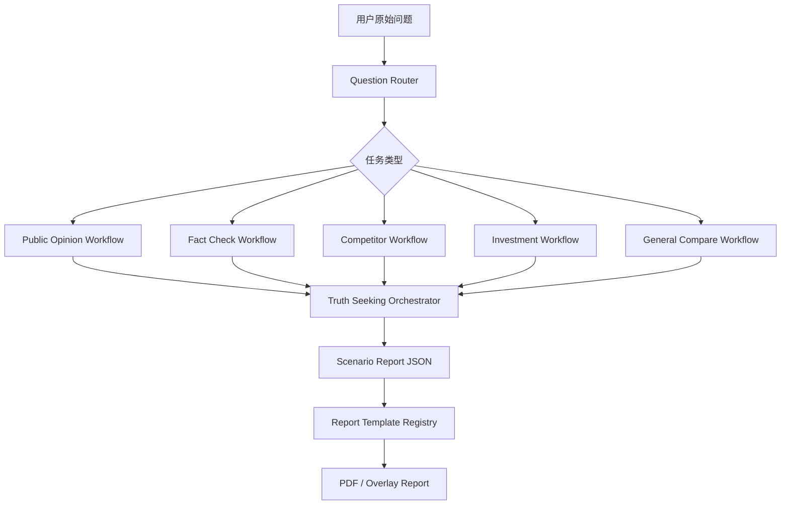

# 场景化执行链路与报告模板实施方案

## 目标

把当前「一条通用多模型去伪链路」升级为「按客户问题自动选择执行链路和报告模板」的多源大模型情报分析平台。

用户不需要理解 Prompt、模型差异或报告结构。系统先判断问题类型，再选择最合适的分析链路、追问策略、污染剔除规则和报告模板，最终输出能直接决策的专业报告。

## 核心判断

当前产品的商业价值不在「同时打开多个 AI 窗口」，而在「把多个 AI 的混乱回答变成可采信结论」。下一阶段的壁垒应该从多模型分发升级为场景化裁决能力。

新的产品主线：

```text
用户问题
→ 任务路由
→ 场景化问题补全
→ 多模型分发
→ 主张抽取
→ 差异识别
→ 场景化追问
→ 污染剔除
→ 可信度评分
→ 场景报告模板
→ 决策结论
```

## 设计原则

- AI 回答是线索，不是证据。
- 每个场景有自己的判断标准，不共用一套泛化报告。
- 用户看到的是决策报告，不是模型聊天记录。
- 路由、Prompt、流程编排、报告渲染必须分模块，不允许继续塞进 `app.js` 或单个大模板文件。
- 默认报告名称保持为 `滤镜·多源大模型内容对比分析`，不得因模板改版漂移。

## 第一阶段支持的 4 类任务

### 1. 舆情裁决

适合问题：

- 「某明星最近舆论怎么样？」
- 「某品牌是不是翻车了？」
- 「这个事件有没有发酵？」

目标：

判断是否形成真实舆情事件、风险等级、是否需要回应、下一步核验动作。

关键字段：

- 舆论温度
- 负面密度
- 阵营分布
- 核心叙事
- 可验证事实
- 污染信息
- 是否需要公开回应

报告结构：

```text
封面裁决
Executive War Room
用户问题裁决
舆论结构看板
事实时间轴
证据漏斗
差异侦查台
污染剔除裁决
下一步核验行动
审计附录
```

### 2. 内容真假核验

适合问题：

- 「这个爆料真实吗？」
- 「这段话是不是谣言？」
- 「这张图/这篇文章可信吗？」

目标：

把内容拆成可验证主张，判断真假、来源强度和污染类型。

关键字段：

- 原始主张
- 可验证事实
- 反证
- 信源等级
- 旧闻翻炒
- 张冠李戴
- AI 生成痕迹
- 最终可信度

报告结构：

```text
真假裁决
主张拆解
证据链地图
反证与冲突
污染源识别
可信度评分
最终结论
核验建议
```

### 3. 竞品对比

适合问题：

- 「A 产品和 B 产品哪个好？」
- 「竞品最近有什么动作？」
- 「这个产品相比竞品优势在哪？」

目标：

基于多个模型与可验证资料，输出选型、差异、风险和建议。

关键字段：

- 对比对象
- 对比维度
- 功能差异
- 价格/定位
- 渠道/用户反馈
- 风险点
- 推荐选型

报告结构：

```text
选型结论
对比对象定义
核心差异矩阵
优势与短板
场景适配度
风险与不确定性
最终建议
```

### 4. 投研 / 政策影响

适合问题：

- 「这个政策对某行业有什么影响？」
- 「某公司最近风险大吗？」
- 「这个事件利好谁？」

目标：

识别影响路径、受益受损主体、确定性和后续观察指标。

关键字段：

- 事件摘要
- 影响主体
- 产业链位置
- 受益方
- 受损方
- 关键不确定性
- 后续观察指标

报告结构：

```text
投资/行业判断
事件事实坐标
影响路径图
受益受损矩阵
模型分歧
风险等级
观察指标
结论与动作
```

## 暂缓主打的高风险任务

法律、医疗、金融投资建议可以识别，但第一阶段不主打。系统应输出「初筛 / 风险提示 / 需专业人士复核」，避免包装成正式意见。

## 模块设计

### 1. Question Router

职责：

识别用户问题属于哪个场景，并输出推荐链路和模板。

建议文件：

```text
src/electron/renderer/task-router.js
src/electron/renderer/task-router-prompts.js
```

输出结构：

```json
{
  "task_type": "public_opinion",
  "confidence": 0.86,
  "reason": "用户询问公众人物近期舆论情况",
  "recommended_workflow": "public_opinion_truth_workflow",
  "recommended_template": "public_opinion_verdict_report",
  "risk_note": ""
}
```

路由类型：

```text
public_opinion
fact_check
competitor_analysis
investment_research
legal_risk
general_compare
```

低置信度处理：

- 如果路由置信度低于 0.62，使用 `general_compare`。
- 如果问题明显高风险，进入保守链路。
- 不弹复杂选择题给用户，最多在报告里说明「系统按某场景处理」。

### 2. Workflow Registry

职责：

按任务类型注册不同执行链路。

建议文件：

```text
src/electron/renderer/workflow-registry.js
src/electron/renderer/workflows/public-opinion-workflow.js
src/electron/renderer/workflows/fact-check-workflow.js
src/electron/renderer/workflows/competitor-workflow.js
src/electron/renderer/workflows/investment-workflow.js
```

接口草案：

```js
const workflow = registry.resolve(taskType);

workflow = {
  id,
  label,
  buildRefinePrompt,
  buildDispatchPrompt,
  buildDiffExtractPrompt,
  buildFollowupPrompt,
  buildPollutionPrompt,
  buildReportPrompt,
  normalizeReportJson
};
```

当前 `truth-seeking.js` 不应该继续膨胀。它应变成通用 orchestrator：

```text
读取 workflow
执行统一步骤
把每一步 prompt 构造交给 workflow
把 JSON 标准化交给 workflow/report-schema
```

### 3. Report Template Registry

职责：

根据任务类型选择报告渲染模板。

建议文件：

```text
src/electron/report/report-template-registry.js
src/electron/report/templates/public-opinion-template.js
src/electron/report/templates/fact-check-template.js
src/electron/report/templates/competitor-template.js
src/electron/report/templates/investment-template.js
```

接口草案：

```js
const template = reportTemplateRegistry.resolve(taskType);
const html = template.buildReportHtml(payload, structuredReport);
```

注意：

当前 `fact-template.js` 已经较大，后续不要继续把所有模板塞进去。新模板应该独立文件，公共图表抽到 `fact-charts.js` 或新的 `report-charts.js`。

### 4. Scenario Report Schema

职责：

定义每个场景的 JSON 输入结构，保证前端报告不是靠纯文本猜。

建议文件：

```text
src/electron/renderer/report-schemas/public-opinion-schema.js
src/electron/renderer/report-schemas/fact-check-schema.js
src/electron/renderer/report-schemas/competitor-schema.js
src/electron/renderer/report-schemas/investment-schema.js
```

公共字段：

```json
{
  "meta": {
    "task_type": "public_opinion",
    "question_original": "",
    "question_refined": "",
    "models": [],
    "generated_at": ""
  },
  "executive_conclusion": {
    "one_sentence": "",
    "confidence_score": 0,
    "risk_level": "low | medium | high",
    "recommended_action": ""
  },
  "evidence_funnel": {},
  "dispute_map": {},
  "source_diagnosis": {},
  "audit": {}
}
```

每个场景追加自己的字段。例如舆情：

```json
{
  "public_opinion": {
    "temperature": 0,
    "negative_density": 0,
    "camp_distribution": [],
    "narratives": [],
    "response_needed": false,
    "monitoring_window": "24h"
  }
}
```

## 执行链路详解

### Step 0: 路由

输入用户原始问题。

输出：

- `task_type`
- `workflow_id`
- `template_id`
- 路由理由

### Step 1: 场景化补全

不同场景补全不同任务书。

例如舆情：

```text
请围绕对象的近期公开舆论、争议事件、情绪结构、传播风险、可验证信源和是否需要回应进行分析。
区分可验证事实、未证实传言、模型推测和污染信息。
用户未指定日期时，按最近/当前处理，不要自行添加具体日期。
```

例如竞品：

```text
请明确对比对象，按功能、价格、定位、用户评价、适用场景、风险和选型建议进行结构化分析。
不要把单一模型观点当成市场事实。
```

### Step 2: 多模型分发

分发 Prompt 根据场景变化，不再使用单一通用 Prompt。

每个 Prompt 必须要求模型输出：

- 关键事实
- 判断依据
- 不确定性
- 需要核验的问题
- 不得确认的内容

### Step 3: 主张抽取

把所有模型回答拆成 claim。

Claim 结构：

```json
{
  "id": "C1",
  "subject": "",
  "predicate": "",
  "object": "",
  "time": "",
  "source_type": "model | external | user_material",
  "models": [],
  "confidence": 0,
  "status": "verified | disputed | unverified | polluted",
  "pollution_flags": []
}
```

### Step 4: 差异追问

不同场景追问重点不同。

舆情：

- 是否把历史事件当成最新事件？
- 是否把网友评论误判为舆情事件？
- 是否缺少传播规模证据？

真假核验：

- 该主张是否有原始信源？
- 是否存在反证？
- 是否为旧闻翻炒？

投研：

- 影响路径是否成立？
- 受益主体是否被过度推断？
- 时间窗口是否错配？

### Step 5: 污染剔除

污染类型统一枚举：

```text
source_missing
time_mismatch
old_news_recycled
opinion_as_fact
model_hallucination
single_source_loop
emotion_amplification
entity_confusion
ai_generated_trace
```

### Step 6: 可信度评分

建议评分公式：

```text
可信度 =
多模型一致性 * 0.20
+ 证据强度 * 0.25
+ 信源等级 * 0.20
+ 时间新鲜度 * 0.10
+ 逻辑闭环度 * 0.15
+ 场景适配度 * 0.10
- 污染惩罚
- 幻觉惩罚
```

评分必须可解释，报告里展示各维度。

### Step 7: 场景报告生成

报告必须第一屏回答：

- 结论是什么？
- 可信度多少？
- 风险等级？
- 是否需要行动？
- 下一步做什么？

## UI 交互建议

用户输入后，聊天流展示：

```text
正在识别问题类型
已识别：舆情裁决
正在补全任务书
正在分发给多模型
正在抽取事实主张
正在识别差异
正在追问关键分歧
正在剔除污染信息
正在生成舆情裁决报告
```

报告卡片上显示：

```text
舆情裁决报告已生成
任务类型：舆情裁决
可信度：76
风险等级：MEDIUM
按钮：打开报告
```

如果路由不确定：

```text
系统按「通用多源对比」处理
原因：问题意图不够明确
```

## 推荐开发顺序

### 里程碑 1: 路由器最小闭环

目标：

让系统能识别任务类型，但仍复用现有通用链路。

任务：

- 新增 `task-router.js`
- 新增 `task-router-prompts.js`
- 在问题补全前调用路由
- 把 `task_type` 写入 session 和报告 JSON
- 聊天流显示「已识别任务类型」

验收：

- 「郭德纲最近舆论怎么看」识别为 `public_opinion`
- 「这个爆料真实吗」识别为 `fact_check`
- 「A 和 B 哪个好」识别为 `competitor_analysis`
- 路由失败时回退 `general_compare`

### 里程碑 2: 舆情链路独立化

目标：

把当前最强的报告能力沉淀成第一个独立 workflow。

任务：

- 新增 `workflows/public-opinion-workflow.js`
- 抽出舆情补全 Prompt
- 抽出舆情差异追问 Prompt
- 抽出舆情污染剔除规则
- 报告 JSON 增加 `public_opinion` 字段

验收：

- 舆情问题报告第一屏直接回答「有没有形成舆情事件」
- 报告包含舆论温度、负面密度、是否需要回应

### 里程碑 3: 内容真假核验链路

目标：

形成第二个可卖场景。

任务：

- 新增 `fact-check-workflow.js`
- 新增真假核验报告模板
- 增加 claim 级证据表
- 增加污染类型统计

验收：

- 输入爆料类问题后，报告能拆出多个事实主张
- 每条主张有可信/待核验/不可信状态

### 里程碑 4: 模板注册表

目标：

彻底避免所有模板堆进 `fact-template.js`。

任务：

- 新增 `report-template-registry.js`
- 把当前 `fact-template.js` 标记为 public opinion 默认模板
- 新模板独立文件
- 主进程导出 PDF 时按 `task_type` 选择模板

验收：

- 不同 `task_type` 能生成不同页面结构
- 默认报告名仍为 `滤镜·多源大模型内容对比分析`

### 里程碑 5: 外部信源核验

目标：

从「AI 互相投票」升级为「AI + 外部证据」。

任务：

- 先接搜索 API 或可控网页搜索
- 把外部信源纳入 claim
- 报告展示外部证据和反证

验收：

- 报告能说明某主张是否有外部证据支持
- 可信度评分引用外部信源强度

## 技术边界

不要做：

- 不要把所有场景 Prompt 写进 `truth-seeking.js`
- 不要把所有报告模板写进 `fact-template.js`
- 不要让路由结果只存在 UI 文案里，必须进入 session 和 JSON
- 不要把法律/医疗/金融建议包装成正式结论

必须做：

- 每个 workflow 独立 Prompt 构造
- 每个 template 独立渲染入口
- 每个 schema 有 normalize 层
- 每个阶段失败都能回退到通用链路

## 数据流草案



## 成功标准

产品层：

- 用户不需要选择模板，系统自动判断。
- 报告第一屏能直接回答用户真正问题。
- 不同场景报告看起来和指标体系明显不同。

商业层：

- 舆情、公关、咨询、投研客户能感知这是专业报告，不是通用 AI 总结。
- 报告能解释为什么某些主张被剔除。
- 客户愿意把报告发给老板或客户。

工程层：

- `app.js` 不增加新业务逻辑。
- `truth-seeking.js` 只保留编排职责。
- 新场景通过注册表接入，而不是修改核心流程大文件。

